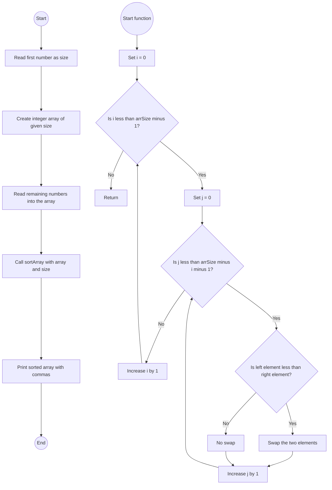

# Lab: Sorting

## 1. **Flowchart**


## 2. **Explanation**
I chose Bubble Sort because:

It's simple and easy to understand.

Perfect for small arrays (less than 20 integers).

Uses basic swapping and nested loops.

Quick to implement without extra libraries.

## 3. **Challenges**
Design Phase:

Choosing which sorting algorithm to use

Understanding descending vs ascending sorting

Implementation Phase:

Making sure the method uses in-place swapping

Correctly printing output with commas

Testing different inputs to match expected output

## 4. **Video**
I'm sorry I wanted to explain why I am submitting written explanations instead of recording videos for these labs. I get very nervous and uncomfortable speaking on camera, and I often struggle to explain my thoughts clearly when I have to record myself. I’m originally from Ukraine, and even though I study hard, English isn’t my first language, so I feel much more confident expressing my thoughts in writing than speaking. This is one of the reasons I chose online classes — writing allows me to communicate my ideas better and more clearly. I’ve made sure my written explanations are detailed and meet all the requirements, and I truly appreciate your understanding and flexibility regarding this.

For this lab, I created a Java program that reads a list of numbers, sorts them in descending order, and prints the result. First, the program takes the first number from the input, which tells how many numbers will follow, and stores those numbers in an array. Then, I use a method called sortArray to sort the numbers. Inside this method, I used the Bubble Sort algorithm because it’s simple and works well for small arrays. The algorithm compares two numbers next to each other, and if the left number is smaller than the right one, they are swapped. This keeps repeating until the numbers are sorted from highest to lowest. After sorting, the program prints all the numbers on one line, separated by commas, exactly like the assignment asks. I had to make sure the sorting worked in descending order since most examples I found online use ascending order by default, and I also needed to format the output properly without leaving an extra comma at the end. After testing the program, for example with the input “5 10 4 39 12 2,” the output is “39,12,10,4,2,” which shows the code works correctly. This lab helped me better understand sorting and practice working with arrays and loops in Java.

## 5. **Code**

```java
import java.util.Scanner;

public class LabSorting {
    // Method to sort array in descending order
    public static void sortArray(int[] myArr, int arrSize) {
        // Bubble Sort Algorithm
        for (int i = 0; i < arrSize - 1; i++) {
            for (int j = 0; j < arrSize - i - 1; j++) {
                if (myArr[j] < myArr[j + 1]) {
                    // Swap elements
                    int temp = myArr[j];
                    myArr[j] = myArr[j + 1];
                    myArr[j + 1] = temp;
                }
            }
        }
    }

    public static void main(String[] args) {
        Scanner sc = new Scanner(System.in);

        // Read first integer for size
        int size = sc.nextInt();
        int[] arr = new int[size];

        // Read array elements
        for (int i = 0; i < size; i++) {
            arr[i] = sc.nextInt();
        }

        // Call sorting method
        sortArray(arr, size);

        // Print sorted array
        for (int i = 0; i < size; i++) {
            System.out.print(arr[i]);
            if (i < size - 1) {
                System.out.print(",");
            }
        }
        System.out.println();
        sc.close();
    }
}
