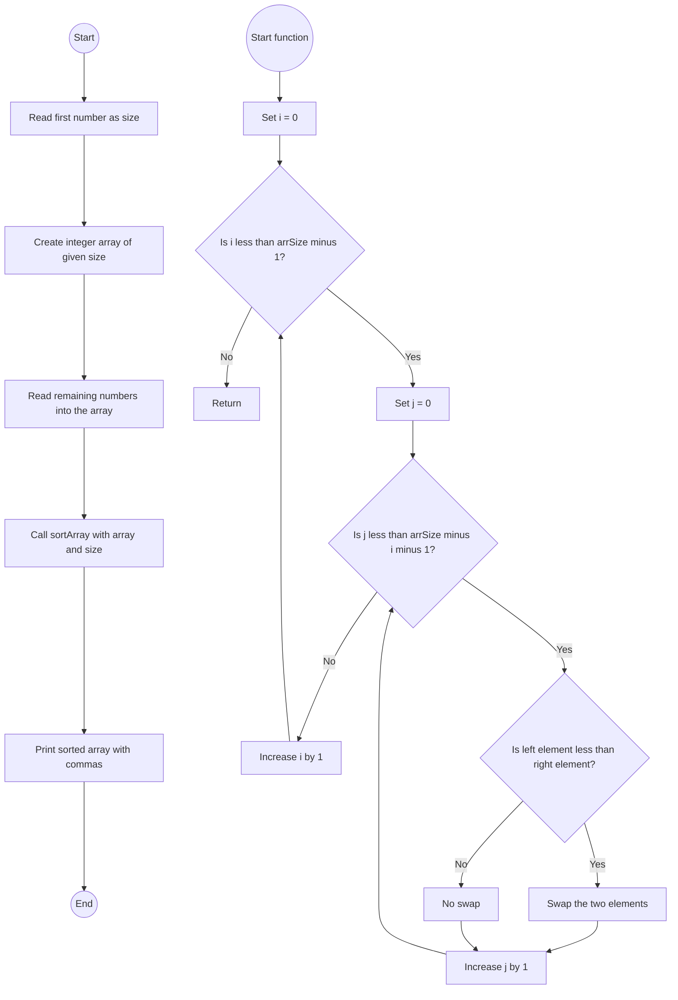

# Lab: Sorting

## 1. **Flowchart**


## 2. **Explanation**
I chose Bubble Sort because:

It's simple and easy to understand.

Perfect for small arrays (less than 20 integers).

Uses basic swapping and nested loops.

Quick to implement without extra libraries.

## 3. **Challenges**
Design Phase:

Choosing which sorting algorithm to use

Understanding descending vs ascending sorting

Implementation Phase:

Making sure the method uses in-place swapping

Correctly printing output with commas

Testing different inputs to match expected output

## 4. **Video**


## 5. **Code**

```java
import java.util.Scanner;

public class LabSorting {
    // Method to sort array in descending order
    public static void sortArray(int[] myArr, int arrSize) {
        // Bubble Sort Algorithm
        for (int i = 0; i < arrSize - 1; i++) {
            for (int j = 0; j < arrSize - i - 1; j++) {
                if (myArr[j] < myArr[j + 1]) {
                    // Swap elements
                    int temp = myArr[j];
                    myArr[j] = myArr[j + 1];
                    myArr[j + 1] = temp;
                }
            }
        }
    }

    public static void main(String[] args) {
        Scanner sc = new Scanner(System.in);

        // Read first integer for size
        int size = sc.nextInt();
        int[] arr = new int[size];

        // Read array elements
        for (int i = 0; i < size; i++) {
            arr[i] = sc.nextInt();
        }

        // Call sorting method
        sortArray(arr, size);

        // Print sorted array
        for (int i = 0; i < size; i++) {
            System.out.print(arr[i]);
            if (i < size - 1) {
                System.out.print(",");
            }
        }
        System.out.println();
        sc.close();
    }
}
