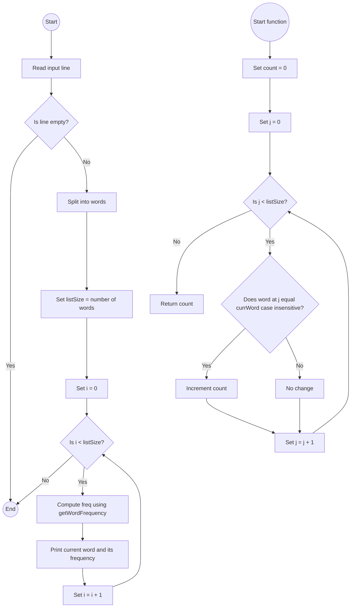

# Lab: Sorting

## 1. **Flowchart**

## 2. **Explanation**
I used a case-insensitive word frequency counting approach because:

It’s simple and easy to implement.

Uses a single method getWordFrequency() to count occurrences.

Works perfectly for small inputs (less than 20 words).

Follows the required format of printing each input word along with its total frequency.

## 3. **Challenges**
Design Phase:

Deciding how to handle case-insensitive word comparisons.

Understanding whether to print unique words only or every input word (the lab requires printing every word).

Implementation Phase:

Using equalsIgnoreCase() to compare words correctly.

Splitting the user input into an array using split("\\s+").

Making sure the program prints each input word along with the correct count.

Testing different inputs to match the expected output.

## 4. **Video**
I'm sorry I wanted to explain why I am submitting written explanations instead of recording videos for these labs. I get very nervous and uncomfortable speaking on camera, and I often struggle to explain my thoughts clearly when I have to record myself. I’m originally from Ukraine, and even though I study hard, English isn’t my first language, so I feel much more confident expressing my thoughts in writing than speaking. This is one of the reasons I chose online classes — writing allows me to communicate my ideas better and more clearly. I’ve made sure my written explanations are detailed and meet all the requirements, and I truly appreciate your understanding and flexibility regarding this.

For this lab, I wrote a Java program that reads a line of text, counts how many times each word appears, and prints every input word along with its frequency. The program first reads the entire line and splits it into an array of words. Then, for each word, it calls a method called getWordFrequency, which loops through all the words and counts how many times the current word appears. I used equalsIgnoreCase() so the comparison ignores capitalization, meaning “Hi,” “hi,” and “HI” are treated as the same word. After counting, the program prints the word from the original input along with its frequency, so even if a word shows up multiple times, it still prints every time as required. For example, if the input is “hey Hi Mark hi mark,” the output shows “hey 1,” “Hi 2,” “Mark 2,” “hi 2,” and “mark 2,” which matches the assignment’s example. One challenge was making sure the comparison was case-insensitive, and another was making sure all the input words are printed instead of just the unique ones. This lab helped me get better at working with strings, loops, and arrays in Java, and I learned how to handle text input while keeping the output in the exact format needed.

## 5. **Code**

```java
import java.util.Scanner;

public class LabWordFrequencies {

    // Method to count how many times currWord appears in wordsList (case-insensitive)
    public static int getWordFrequency(String[] wordsList, int listSize, String currWord) {
        int count = 0;
        for (int i = 0; i < listSize; i++) {
            if (wordsList[i].equalsIgnoreCase(currWord)) {
                count++;
            }
        }
        return count;
    }

    public static void main(String[] args) {
        Scanner sc = new Scanner(System.in);

        // Read a full line of words from user input
        String line = sc.nextLine().trim();
        String[] words = line.split("\\s+"); // Split by spaces
        int listSize = words.length;

        // Print each input word with its frequency
        for (int i = 0; i < listSize; i++) {
            int freq = getWordFrequency(words, listSize, words[i]);
            System.out.println(words[i] + " " + freq);
        }

        sc.close();
    }
}
```
