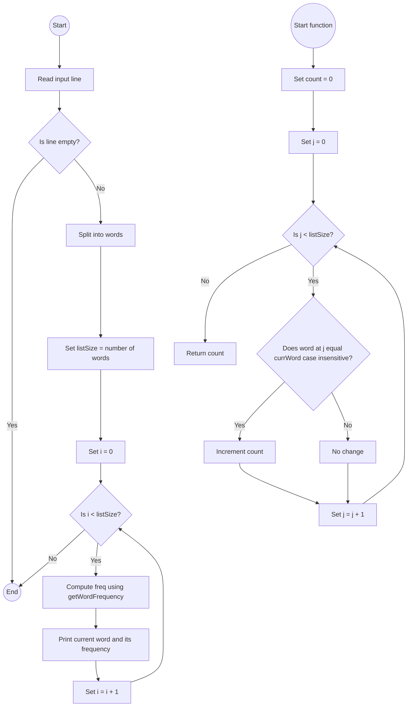

# Lab: Sorting

## 1. **Flowchart**

## 2. **Explanation**
I used a case-insensitive word frequency counting approach because:

It’s simple and easy to implement.

Uses a single method getWordFrequency() to count occurrences.

Works perfectly for small inputs (less than 20 words).

Follows the required format of printing each input word along with its total frequency.

## 3. **Challenges**
Design Phase:

Deciding how to handle case-insensitive word comparisons.

Understanding whether to print unique words only or every input word (the lab requires printing every word).

Implementation Phase:

Using equalsIgnoreCase() to compare words correctly.

Splitting the user input into an array using split("\\s+").

Making sure the program prints each input word along with the correct count.

Testing different inputs to match the expected output.

## 4. **Video**


## 5. **Code**

```java
import java.util.Scanner;

public class LabWordFrequencies {

    // Method to count how many times currWord appears in wordsList (case-insensitive)
    public static int getWordFrequency(String[] wordsList, int listSize, String currWord) {
        int count = 0;
        for (int i = 0; i < listSize; i++) {
            if (wordsList[i].equalsIgnoreCase(currWord)) {
                count++;
            }
        }
        return count;
    }

    public static void main(String[] args) {
        Scanner sc = new Scanner(System.in);

        // Read a full line of words from user input
        String line = sc.nextLine().trim();
        String[] words = line.split("\\s+"); // Split by spaces
        int listSize = words.length;

        // Print each input word with its frequency
        for (int i = 0; i < listSize; i++) {
            int freq = getWordFrequency(words, listSize, words[i]);
            System.out.println(words[i] + " " + freq);
        }

        sc.close();
    }
}
```
