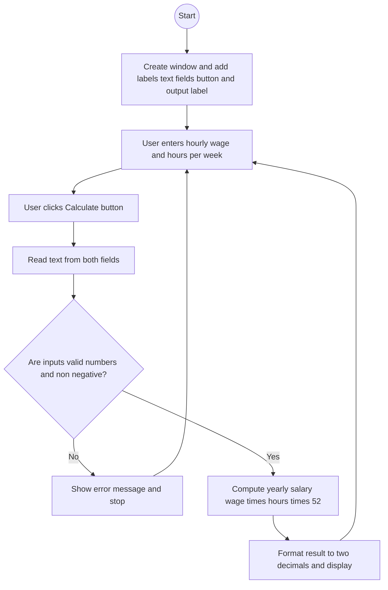

# Lab: GUI Input and ActionListeners
## 1. Flowchart


## 2. Challenges:

**Design Phase:**

Deciding the simplest layout so labels, fields, and the button are clear and aligned.

Choosing where to show results and validation errors without popping too many dialogs.
<br>
</br>

**Implementation Phase:**

Parsing text input safely and handling `NumberFormatException`.

Ensuring negative values are rejected politely.

Formatting the salary to two decimal places and updating the GUI on the Event Dispatch Thread.

## 3. Video:
In this lab, I built a small Java Swing app that takes two inputs `hourly wage` and `hours per week` and calculates the `yearly salary`. The interface has labels, two `JTextField` inputs, a Calculate button, and a label that shows the result. When the button is clicked, an `ActionListener` reads the text from both fields, validates the values, and if they are valid, computes `wage × hours × 52`. The result is formatted to two decimals and shown in the output label. If the input is invalid or negative, the program shows a clear error message and asks the user to correct it. This lab helped me practice the basic Swing components, event handling with `ActionListener`, input validation, and updating the UI safely on the Event Dispatch Thread.

## 4. Code:
`SalaryCalculatorGUI.java`

``` java
import javax.swing.*;
import java.awt.*;
import java.awt.event.ActionEvent;
import java.awt.event.ActionListener;

public class SalaryCalculatorGUI extends JFrame {

    private final JTextField wageField;
    private final JTextField hoursField;
    private final JLabel resultLabel;

    public SalaryCalculatorGUI() {
        super("Yearly Salary Calculator");

        // Components
        JLabel wageLabel = new JLabel("Hourly wage:");
        wageField = new JTextField(10);

        JLabel hoursLabel = new JLabel("Hours per week:");
        hoursField = new JTextField(10);

        JButton calcButton = new JButton("Calculate");
        resultLabel = new JLabel("Yearly salary: ");

        // Layout (simple, clean)
        JPanel form = new JPanel(new GridBagLayout());
        GridBagConstraints gc = new GridBagConstraints();
        gc.insets = new Insets(6, 6, 6, 6);
        gc.fill = GridBagConstraints.HORIZONTAL;

        gc.gridx = 0; gc.gridy = 0; form.add(wageLabel, gc);
        gc.gridx = 1; gc.gridy = 0; form.add(wageField, gc);

        gc.gridx = 0; gc.gridy = 1; form.add(hoursLabel, gc);
        gc.gridx = 1; gc.gridy = 1; form.add(hoursField, gc);

        gc.gridx = 0; gc.gridy = 2; gc.gridwidth = 2; form.add(calcButton, gc);
        gc.gridx = 0; gc.gridy = 3; gc.gridwidth = 2; form.add(resultLabel, gc);

        add(form);

        // Button logic
        calcButton.addActionListener(new ActionListener() {
            @Override
            public void actionPerformed(ActionEvent e) {
                onCalculate();
            }
        });

        // Frame settings
        setDefaultCloseOperation(JFrame.EXIT_ON_CLOSE);
        pack();
        setLocationRelativeTo(null); // center window
    }

    private void onCalculate() {
        String wageText = wageField.getText().trim();
        String hoursText = hoursField.getText().trim();

        double wage;
        double hours;

        try {
            wage = Double.parseDouble(wageText);
            hours = Double.parseDouble(hoursText);
        } catch (NumberFormatException ex) {
            JOptionPane.showMessageDialog(
                    this,
                    "Please enter valid numbers for wage and hours.",
                    "Input Error",
                    JOptionPane.ERROR_MESSAGE
            );
            return;
        }

        if (wage < 0 || hours < 0) {
            JOptionPane.showMessageDialog(
                    this,
                    "Values must be non-negative.",
                    "Input Error",
                    JOptionPane.ERROR_MESSAGE
            );
            return;
        }

        double yearly = wage * hours * 52.0;
        resultLabel.setText(String.format("Yearly salary: %.2f", yearly));
    }

    public static void main(String[] args) {
        SwingUtilities.invokeLater(() -> {
            new SalaryCalculatorGUI().setVisible(true);
        });
    }
}
```
