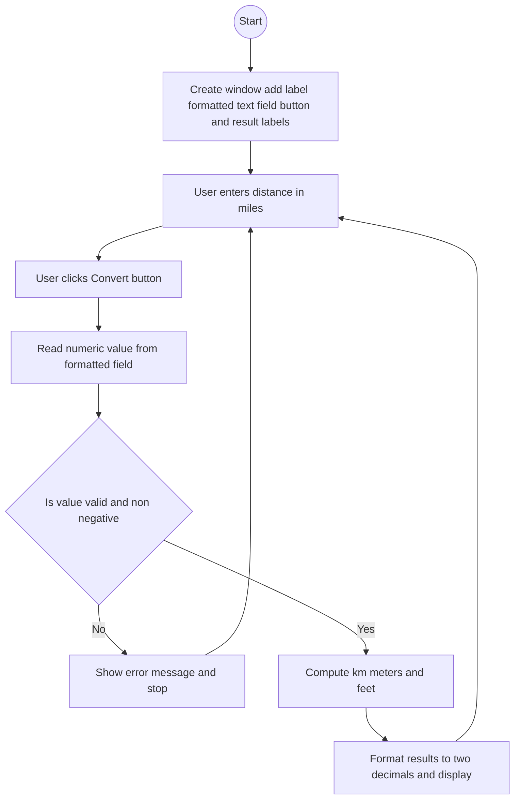

# Lab: GUI Input and Formatted Text Fields
## 1. Flowchart


## 2. Challenges:

**Design Phase:**

Choosing a simple layout that clearly presents one input and several outputs.

Deciding to use JFormattedTextField with a NumberFormatter so the input is restricted to numeric values.
<br>
</br>

**Implementation Phase:**

Configuring the formatter to allow decimals and reject negatives gracefully.

Ensuring calculations are correct and consistently formatted to two decimals.

Updating labels on the Event Dispatch Thread and providing helpful error messages.

## 3. Video:
In this lab, I built a small Swing app that takes a single numeric input `a distance in miles` and shows the converted values in `kilometers, meters, and feet`. I used a `JFormattedTextField` so the input is validated as a number. When the user clicks Convert, an `ActionListener` reads the value, checks that it is non-negative, and then calculates the results using these conversions: 1 mile = 1.60934 km = 1609.34 m = 5280 ft. The app formats the results to two decimal places and displays them in labels. If the value is invalid or negative, it shows a clear error message. This activity helped me practice input validation with `JFormattedTextField`, event handling with `ActionListener`, and GUI updates with Swing.

## 4. Code:
`DistanceConverterGUI.java`

``` java
import javax.swing.*;
import javax.swing.text.NumberFormatter;
import java.awt.*;
import java.awt.event.ActionEvent;
import java.text.NumberFormat;

public class DistanceConverterGUI extends JFrame {
    private final JFormattedTextField milesField;
    private final JLabel kmLabel;
    private final JLabel mLabel;
    private final JLabel ftLabel;

    public DistanceConverterGUI() {
        super("Distance Converter (Miles -> km, m, ft)");

        // Formatter for miles input (non-negative decimal)
        NumberFormat nf = NumberFormat.getNumberInstance();
        nf.setGroupingUsed(false);
        NumberFormatter formatter = new NumberFormatter(nf);
        formatter.setValueClass(Double.class);
        formatter.setMinimum(0.0);
        formatter.setAllowsInvalid(false);  // disallow invalid chars
        formatter.setCommitsOnValidEdit(true);

        JLabel milesPrompt = new JLabel("Miles:");
        milesField = new JFormattedTextField(formatter);
        milesField.setColumns(10);

        JButton convertBtn = new JButton("Convert");

        kmLabel = new JLabel("Kilometers: ");
        mLabel  = new JLabel("Meters: ");
        ftLabel = new JLabel("Feet: ");

        // Layout: compact grid using GridBagLayout
        JPanel panel = new JPanel(new GridBagLayout());
        GridBagConstraints gc = new GridBagConstraints();
        gc.insets = new Insets(6, 6, 6, 6);
        gc.anchor = GridBagConstraints.WEST;
        gc.fill = GridBagConstraints.HORIZONTAL;

        gc.gridx = 0; gc.gridy = 0; panel.add(milesPrompt, gc);
        gc.gridx = 1; gc.gridy = 0; panel.add(milesField, gc);

        gc.gridx = 0; gc.gridy = 1; gc.gridwidth = 2; panel.add(convertBtn, gc);

        gc.gridx = 0; gc.gridy = 2; gc.gridwidth = 2; panel.add(kmLabel, gc);
        gc.gridx = 0; gc.gridy = 3; gc.gridwidth = 2; panel.add(mLabel, gc);
        gc.gridx = 0; gc.gridy = 4; gc.gridwidth = 2; panel.add(ftLabel, gc);

        add(panel);

        // Button action
        convertBtn.addActionListener(this::onConvert);

        // Frame settings
        setDefaultCloseOperation(JFrame.EXIT_ON_CLOSE);
        pack();
        setLocationRelativeTo(null);
    }

    private void onConvert(ActionEvent e) {
        Object val = milesField.getValue();
        if (!(val instanceof Number)) {
            JOptionPane.showMessageDialog(this, "Please enter a valid non-negative number for miles.",
                    "Input Error", JOptionPane.ERROR_MESSAGE);
            return;
        }
        double miles = ((Number) val).doubleValue();
        if (miles < 0) {
            JOptionPane.showMessageDialog(this, "Miles must be non-negative.",
                    "Input Error", JOptionPane.ERROR_MESSAGE);
            return;
        }

        // Conversions
        double km = miles * 1.60934;
        double meters = miles * 1609.34;
        double feet = miles * 5280.0;

        kmLabel.setText(String.format("Kilometers: %.2f", km));
        mLabel.setText(String.format("Meters: %.2f", meters));
        ftLabel.setText(String.format("Feet: %.2f", feet));
    }

    public static void main(String[] args) {
        SwingUtilities.invokeLater(() -> new DistanceConverterGUI().setVisible(true));
    }
}
```
