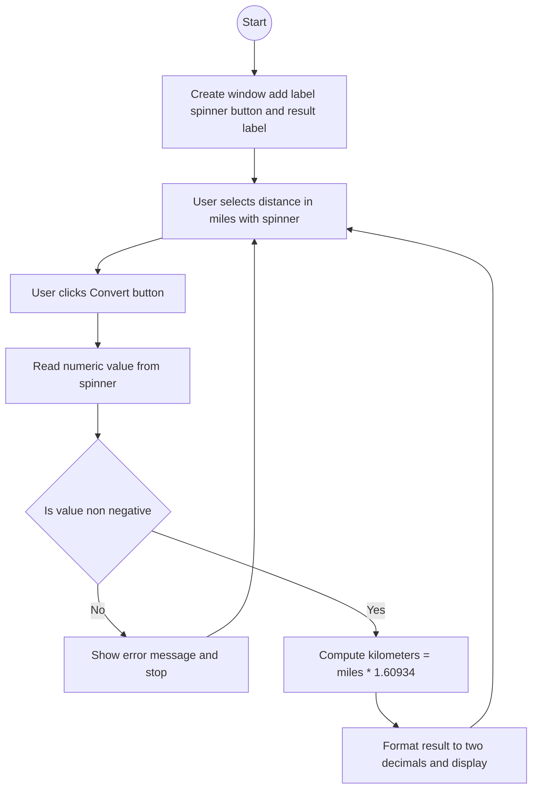

# Lab: GUI Input with JSpinner
## 1. Flowchart


## 2. Challenges:

**Design Phase:**

Choosing JSpinner with a `SpinnerNumberModel` to keep input numeric and user-friendly.

Keeping the layout simple so the input and result are obvious.
<br>
</br>

**Implementation Phase:**

Configuring the spinner to allow decimals and prevent negatives.

Formatting kilometers to two decimals.

Updating the UI on the Event Dispatch Thread and handling edge cases gracefully.

## 3. Video:
In this lab, I created a small Swing app that takes a single numeric input a `distance` in miles using a `JSpinner`, and converts it to `kilometers`. The spinner uses a `SpinnerNumberModel` so the value is always numeric; I configured it with a minimum of 0.0, a reasonable step size, and no negatives. When the user clicks Convert, the app reads the spinner’s value, checks that it’s non-negative, computes `km = miles × 1.60934`, formats the result to two decimals, and displays it in a label. If the value is invalid or negative, the app shows a clear error message. This activity helped me practice GUI input with `JSpinner`, basic validation, event handling with an `ActionListener`, and formatting numeric output.

## 4. Code:
`MilesToKmSpinnerGUI.java`

``` java
import javax.swing.*;
import java.awt.*;
import java.awt.event.ActionEvent;

public class MilesToKmSpinnerGUI extends JFrame {
    private final JSpinner milesSpinner;
    private final JLabel resultLabel;

    public MilesToKmSpinnerGUI() {
        super("Miles -> Kilometers (JSpinner)");

        // Spinner model: value, minimum, maximum, step
        // Allow decimals by using a Double and decimal step
        SpinnerNumberModel model = new SpinnerNumberModel(0.0, 0.0, 1_000_000.0, 0.25);
        milesSpinner = new JSpinner(model);

        // Use a number editor for nicer formatting
        JSpinner.NumberEditor editor = new JSpinner.NumberEditor(milesSpinner, "0.00");
        milesSpinner.setEditor(editor);

        JLabel milesLabel = new JLabel("Miles:");
        JButton convertBtn = new JButton("Convert");
        resultLabel = new JLabel("Kilometers: ");

        // Layout
        JPanel panel = new JPanel(new GridBagLayout());
        GridBagConstraints gc = new GridBagConstraints();
        gc.insets = new Insets(6, 6, 6, 6);
        gc.fill = GridBagConstraints.HORIZONTAL;
        gc.anchor = GridBagConstraints.WEST;

        gc.gridx = 0; gc.gridy = 0; panel.add(milesLabel, gc);
        gc.gridx = 1; gc.gridy = 0; panel.add(milesSpinner, gc);

        gc.gridx = 0; gc.gridy = 1; gc.gridwidth = 2; panel.add(convertBtn, gc);

        gc.gridx = 0; gc.gridy = 2; gc.gridwidth = 2; panel.add(resultLabel, gc);

        add(panel);

        // Button action
        convertBtn.addActionListener(this::onConvert);

        // Frame settings
        setDefaultCloseOperation(JFrame.EXIT_ON_CLOSE);
        pack();
        setLocationRelativeTo(null);
    }

    private void onConvert(ActionEvent e) {
        // Ensure any manual edits are committed from editor to model
        try {
            milesSpinner.commitEdit();
        } catch (java.text.ParseException ignored) {
            // If parsing fails, show message below
        }

        Object val = milesSpinner.getValue();
        if (!(val instanceof Number)) {
            JOptionPane.showMessageDialog(this, "Please enter a valid non-negative number for miles.",
                    "Input Error", JOptionPane.ERROR_MESSAGE);
            return;
        }

        double miles = ((Number) val).doubleValue();
        if (miles < 0) {
            JOptionPane.showMessageDialog(this, "Miles must be non-negative.",
                    "Input Error", JOptionPane.ERROR_MESSAGE);
            return;
        }

        double km = miles * 1.60934;
        resultLabel.setText(String.format("Kilometers: %.2f", km));
    }

    public static void main(String[] args) {
        SwingUtilities.invokeLater(() -> new MilesToKmSpinnerGUI().setVisible(true));
    }
}
```
