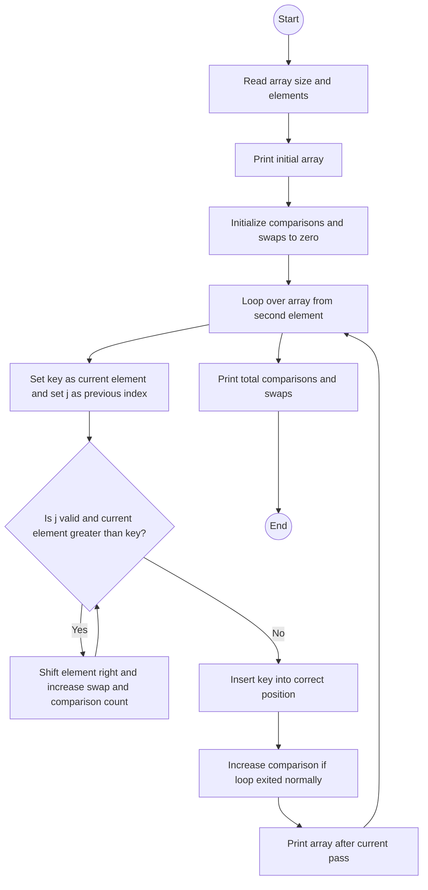

# Lab: Insertion Sort
## 1. Flowchart


## 2. Challenges:

**Design Phase:**

Deciding what to count: comparisons every time we check an element against the key, and swaps as the number of shifts of larger elements to the right.

Matching the exact print format: initial array first, then each pass on its own line, then metrics.
<br>
</br>

**Implementation Phase:**

Counting comparisons correctly, including the final failed comparison that ends the while loop.

Counting swaps as shifts only (not the final key placement) to match the expected totals.

Preserving the exact spacing and blank lines to mirror the sample output.

## 3. Video:
In this lab, I implemented insertion sort and tracked the total number of comparisons and swaps. The program first reads the array size and its elements, prints the initial array, and then runs insertion sort from index 1 to the end. For each position, it treats the current value as the key and shifts all larger elements in the sorted left side one step to the right. I count a comparison every time the algorithm checks `arr[j] > key`, including the final check that fails and exits the loop. I count a swap each time an element is shifted right (assigning `arr[j+1] = arr[j]`). After each outer pass, the program prints the current array state. At the end, it prints the total comparisons and swaps. For the example input `6 3 2 1 5 9 8`, the program’s intermediate lines and the final metrics match the expected output (`comparisons: 7`, `swaps: 4`).

## 4. Code:
`InsertionSortLab.java`

``` java
import java.util.*;

public class InsertionSortLab {

    private static void printArray(int[] arr) {
        for (int i = 0; i < arr.length; i++) {
            if (i > 0) System.out.print(" ");
            System.out.print(arr[i]);
        }
        System.out.println();
    }

    public static void main(String[] args) {
        Scanner sc = new Scanner(System.in);

        // Read size then elements
        if (!sc.hasNextInt()) return;
        int n = sc.nextInt();
        int[] arr = new int[n];
        for (int i = 0; i < n; i++) {
            arr[i] = sc.nextInt();
        }
        sc.close();

        // 1) Print initial array
        printArray(arr);
        System.out.println();

        // 2) Insertion sort with counts
        int comparisons = 0;
        int swaps = 0;

        for (int i = 1; i < n; i++) {
            int key = arr[i];
            int j = i - 1;

            // Count comparisons while we check j >= 0 and whether arr[j] > key
            // We'll count each successful comparison in the while-loop body,
            // and add one extra comparison if the first failed check stops the loop.
            boolean comparedAtLeastOnce = false;

            while (j >= 0) {
                comparedAtLeastOnce = true;
                comparisons++;               // we are performing arr[j] > key check
                if (arr[j] > key) {
                    arr[j + 1] = arr[j];     // shift right
                    swaps++;                  // count shifts as swaps
                    j--;
                } else {
                    break;                    // first non-greater ends the shifting
                }
            }

            arr[j + 1] = key;                 // place key

            // 3) Print array after each pass
            printArray(arr);
        }

        // 4) Final metrics
        System.out.println();
        System.out.println("comparisons: " + comparisons);
        System.out.println("swaps: " + swaps);
    }
}
```
