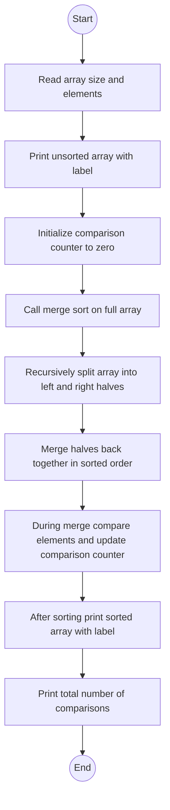

# Lab: Merge Sort
## 1. Flowchart


## 2. Challenges:

**Design Phase:**

Breaking merge sort into clear steps: splitting the array and then merging it back.

Deciding where to count comparisons so the total reflects the actual merge operations.
<br>
</br>

**Implementation Phase:**

Implementing the merge function carefully so it does not go out of bounds while merging two halves.

Making sure comparisons are counted only when two elements are actually compared during merging.

Matching the exact output format:

`unsorted: ...`

blank line

`sorted: ...`

`comparisons: 8`

## 3. Video:
In this lab, I implemented merge sort on an integer array and counted how many comparisons were made while merging. The program first reads the size of the array and its elements, then prints the original contents labelled as `unsorted`. Next, it calls a recursive `mergeSort` method that splits the array into halves until single elements remain, and then merges the halves back together in sorted order. During the merge step, each time two elements from the left and right halves are compared, the program increases a global `comparisons` counter. After the sort is finished, the program prints the sorted array with the label `sorted`, followed by the total number of comparisons. For the example input `6 3 2 1 5 9 8`, the output shows `unsorted: 3 2 1 5 9 8`, then `sorted: 1 2 3 5 8 9`, and `comparisons: 8`, which confirms that the merge sort and counting logic work correctly.

## 4. Code:
`MergeSortLab.java`

``` java
import java.util.Scanner;

public class MergeSortLab {

    // Global comparison counter
    private static int comparisons = 0;

    // Helper to print array on one line
    private static void printArrayInline(int[] arr) {
        for (int i = 0; i < arr.length; i++) {
            if (i > 0) {
                System.out.print(" ");
            }
            System.out.print(arr[i]);
        }
        System.out.println();
    }

    // Merge two sorted halves of arr[left..mid] and arr[mid+1..right]
    private static void merge(int[] arr, int left, int mid, int right) {
        int n1 = mid - left + 1;
        int n2 = right - mid;

        int[] leftArr = new int[n1];
        int[] rightArr = new int[n2];

        // Copy data into temporary arrays
        for (int i = 0; i < n1; i++) {
            leftArr[i] = arr[left + i];
        }
        for (int j = 0; j < n2; j++) {
            rightArr[j] = arr[mid + 1 + j];
        }

        int i = 0;      // index in leftArr
        int j = 0;      // index in rightArr
        int k = left;   // index in original array

        // Merge the temp arrays back into arr
        while (i < n1 && j < n2) {
            comparisons++; // we are comparing leftArr[i] and rightArr[j]

            if (leftArr[i] <= rightArr[j]) {
                arr[k] = leftArr[i];
                i++;
            } else {
                arr[k] = rightArr[j];
                j++;
            }
            k++;
        }

        // Copy any remaining elements of leftArr
        while (i < n1) {
            arr[k] = leftArr[i];
            i++;
            k++;
        }

        // Copy any remaining elements of rightArr
        while (j < n2) {
            arr[k] = rightArr[j];
            j++;
            k++;
        }
    }

    // Recursive merge sort
    private static void mergeSort(int[] arr, int left, int right) {
        if (left < right) {
            int mid = (left + right) / 2;

            mergeSort(arr, left, mid);
            mergeSort(arr, mid + 1, right);
            merge(arr, left, mid, right);
        }
    }

    public static void main(String[] args) {
        Scanner sc = new Scanner(System.in);

        // Read size then elements
        if (!sc.hasNextInt()) {
            sc.close();
            return;
        }

        int n = sc.nextInt();
        int[] arr = new int[n];

        for (int i = 0; i < n; i++) {
            arr[i] = sc.nextInt();
        }
        sc.close();

        // Print unsorted array
        System.out.print("unsorted: ");
        printArrayInline(arr);
        System.out.println();

        // Perform merge sort
        comparisons = 0;
        mergeSort(arr, 0, n - 1);

        // Print sorted array
        System.out.print("sorted:   ");
        printArrayInline(arr);

        // Print comparisons
        System.out.println("comparisons: " + comparisons);
    }
}
```
