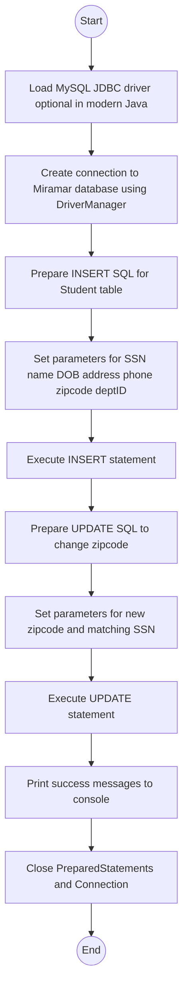

# Lab: Manipulating Databases using Java
## 1. Flowchart


## 2. Challenges:

**Design Phase:**

Deciding which Java classes to use (`Connection`, `PreparedStatement`, `DriverManager`) to keep the code clear and safe.

Designing the INSERT and UPDATE queries so they match the existing `Student` table structure in the `Miramar` database.
<br>
</br>

**Implementation Phase:**

Setting up the correct JDBC URL, database username, and password for the MySQL server.

Using `PreparedStatement` with the correct parameter order and types.

Handling exceptions (like connection problems or SQL errors) and making sure the connection and statements are properly closed using try-with-resources.

## 3. Video:
In this lab, I wrote a Java program that connects to a MySQL database called Miramar and manipulates data in the Student table using the MySQL J Connector. The program first opens a connection to the database using `DriverManager.getConnection()`. Once connected, it uses a `PreparedStatement` to insert a new student record with the given SSN, name fields, date of birth, address-related fields, phone, zipcode, and department ID. After the insert, the program prepares a second `PreparedStatement` with an `UPDATE` statement that changes the student’s zipcode to `92126` based on the SSN.

The code prints messages to the console after the insert and update operations to confirm that the commands executed successfully. I used try-with-resources so that the `Connection` and `PreparedStatement` objects are automatically closed, even if an exception occurs. This lab helped me understand how Java code can send SQL commands to a database, how to use the MySQL driver, and why `PreparedStatement` is useful for both safety and readability.
## 4. Code:
`DatabaseStudentDemo.java`

``` java
import java.sql.Connection;
import java.sql.DriverManager;
import java.sql.PreparedStatement;
import java.sql.SQLException;
import java.sql.Date;

public class DatabaseStudentDemo {

    // NOTE: Replace "your_username" and "your_password" if you actually run the code.
    private static final String DB_URL = "jdbc:mysql://localhost:3306/Miramar";
    private static final String DB_USER = "your_username";
    private static final String DB_PASSWORD = "your_password";

    public static void main(String[] args) {

        // Data to insert
        String ssn = "111222333";
        String firstName = "Philip";
        String middleName = "David Charles";
        String lastName = "Collins";
        Date dob = Date.valueOf("1951-01-30");   // Jan 30, 1951

        String street = "NA";
        String phone = "NA";
        String zipcode = "NA";
        int deptID = 1234;

        String newZipcode = "92126";

        try (Connection conn = DriverManager.getConnection(DB_URL, DB_USER, DB_PASSWORD)) {

            // INSERT
            String insertSql =
                "INSERT INTO Student " +
                "(SSN, firstName, middleName, lastName, DOB, street, phone, zipcode, deptID) " +
                "VALUES (?, ?, ?, ?, ?, ?, ?, ?, ?)";

            try (PreparedStatement insertStmt = conn.prepareStatement(insertSql)) {

                insertStmt.setString(1, ssn);
                insertStmt.setString(2, firstName);
                insertStmt.setString(3, middleName);
                insertStmt.setString(4, lastName);
                insertStmt.setDate(5, dob);
                insertStmt.setString(6, street);
                insertStmt.setString(7, phone);
                insertStmt.setString(8, zipcode);
                insertStmt.setInt(9, deptID);

                int insertedRows = insertStmt.executeUpdate();
                System.out.println("Inserted rows: " + insertedRows);
            }

            // UPDATE
            String updateSql = "UPDATE Student SET zipcode = ? WHERE SSN = ?";

            try (PreparedStatement updateStmt = conn.prepareStatement(updateSql)) {
                updateStmt.setString(1, newZipcode);
                updateStmt.setString(2, ssn);

                int updatedRows = updateStmt.executeUpdate();
                System.out.println("Updated rows: " + updatedRows);
            }

        } catch (SQLException e) {
            e.printStackTrace();
        }
    }
}
```
