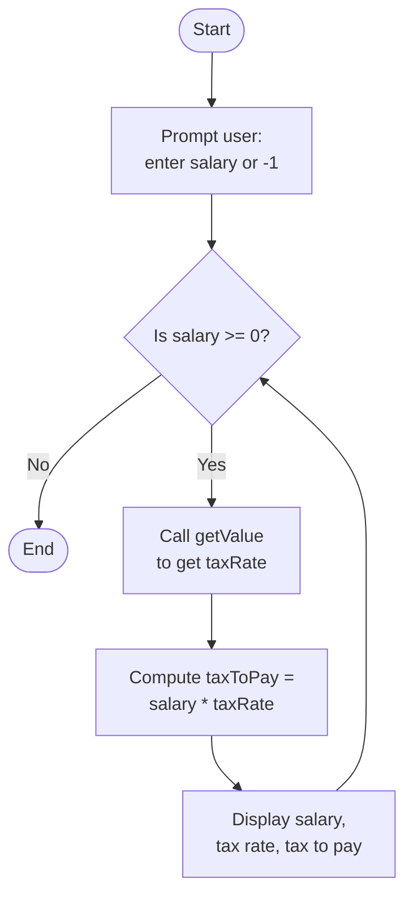
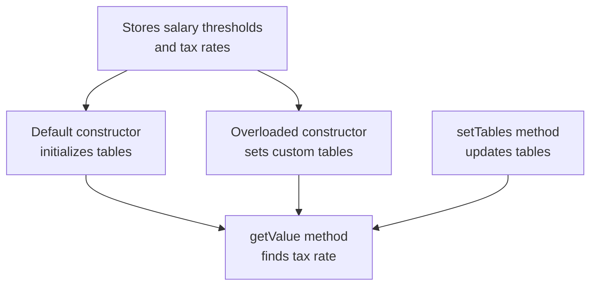

# Lab: Salary calculation

## 1. Flowchart
$${\color{lightblue}Main \space Program \space Flow}$$

$${\color{red}TaxTableTools \space Class \space Responsibilities}$$


## 2. Challenges:

**Design Phase:**

Understanding how to separate the table data from the calculation logic.

Deciding between using a setter method or an overloaded constructor.

Keeping the main program simple while moving most logic into the class.
<br>
</br>

**Implementation Phase:**

Correctly updating and passing custom tables to the class.

Making sure getValue() correctly finds the first matching bracket.

Testing edge cases: 50000 vs 50001 and 100000 vs 100001.

Ensuring calculations are truncated to integers for tax display.

## 3. Video:

In this lab, I created a Java program that calculates the tax rate and tax to pay based on a person’s annual salary. The program uses a class called TaxTableTools to store the salary thresholds and tax rates. The main program asks the user to enter a salary, finds the correct tax rate using the class, calculates the tax to pay, and prints the results.

For Task A, I added a setter method called setTables() that allows the main program to provide custom salary and tax tables instead of using the defaults.

For Task B, I added an overloaded constructor to the class. Instead of calling a setter, the main program passes the tables directly when creating the object. I also modified the salary and tax tables to test different ranges and rates.

After setting up the tables, the program loops and prompts the user for salaries, calculates the tax, and prints the results. The program ends when the user enters -1. I tested the program with salaries 10000, 50000, 50001, and 100001, and confirmed that both tasks produce correct results. This lab helped me understand how to use classes, setter methods, constructors, and method calls to organize and reuse code effectively.

## 4. Code:
**Task A — Using a Setter Method**
<details> <summary> Click to get the TaxTableTools.java </summary>
<p>

``` java
public class TaxTableTools {

   private int[] search =   {   0,  20000, 50000, 100000, Integer.MAX_VALUE };
   private double[] value = { 0.0,   0.10,  0.20,   0.30,              0.40 };
   private int nEntries;

   // Default constructor
   public TaxTableTools() {
      nEntries = search.length;
   }

   // Setter method to replace tables (Task A requirement)
   public void setTables(int[] newSearch, double[] newValue) {
      if (newSearch == null || newValue == null || newSearch.length != newValue.length) {
         throw new IllegalArgumentException("Arrays must be non-null and same length");
      }
      search = new int[newSearch.length];
      value = new double[newValue.length];

      System.arraycopy(newSearch, 0, search, 0, newSearch.length);
      System.arraycopy(newValue, 0, value, 0, newValue.length);

      nEntries = search.length;
   }

   // Get tax rate based on salary
   public double getValue(int searchArgument) {
      double result = 0.0;
      int i = 0;
      boolean keepLooking = true;

      while ((i < nEntries) && keepLooking) {
         if (searchArgument <= search[i]) {
            result = value[i];
            keepLooking = false;
         } else {
            i++;
         }
      }
      return result;
   }
}
```
</p>
</details>

<details> <summary> Click to get the IncomeTaxMain.java </summary>
<p>

``` java
import java.util.Scanner;

public class IncomeTaxMain {

   public static int getInteger(Scanner input, String prompt) {
      System.out.println(prompt + ": ");
      return input.nextInt();
   }

   public static void main(String[] args) {
      final String PROMPT_SALARY = "\nEnter annual salary (-1 to exit)";
      Scanner scnr = new Scanner(System.in);

      int[]    salary   = {   0,  20000, 50000, 100000, Integer.MAX_VALUE };
      double[] taxTable = { 0.0,   0.10,  0.20,   0.30,              0.40 };

      // Create object and set custom tables
      TaxTableTools table = new TaxTableTools();
      table.setTables(salary, taxTable);

      // Input loop
      int annualSalary = getInteger(scnr, PROMPT_SALARY);
      while (annualSalary >= 0) {
         double taxRate = table.getValue(annualSalary);
         int taxToPay = (int) (annualSalary * taxRate);

         System.out.println("Annual Salary: " + annualSalary +
                            "\tTax rate: " + taxRate +
                            "\tTax to pay: " + taxToPay);

         annualSalary = getInteger(scnr, PROMPT_SALARY);
      }
      scnr.close();
   }
}
```
</p>
</details>
<br>
</br>

**Task B — Using an Overloaded Constructor**
<details> <summary> Click to get the TaxTableTools.java </summary>
<p>

``` java
import java.util.Scanner;

public class TaxTableTools {

   private int[] search =   {   0,  20000, 50000, 100000,  Integer.MAX_VALUE };
   private double[] value = { 0.0,   0.10,  0.20,   0.30,               0.40 };
   private int nEntries;

   // Default constructor
   public TaxTableTools() {
      nEntries = search.length;
   }

   // Overloaded constructor (Task B requirement)
   public TaxTableTools(int[] customSearch, double[] customValue) {
      if (customSearch == null || customValue == null || customSearch.length != customValue.length) {
         throw new IllegalArgumentException("Arrays must be non-null and same length");
      }
      search = new int[customSearch.length];
      value = new double[customValue.length];

      System.arraycopy(customSearch, 0, search, 0, customSearch.length);
      System.arraycopy(customValue, 0, value, 0, customValue.length);

      nEntries = search.length;
   }

   // Method to get integer input
   public int getInteger(Scanner input, String prompt) {
      System.out.println(prompt + ": ");
      return input.nextInt();
   }

   // Get tax rate based on salary
   public double getValue(int searchArgument) {
      double result = 0.0;
      int i = 0;
      boolean keepLooking = true;

      while ((i < nEntries) && keepLooking) {
         if (searchArgument <= search[i]) {
            result = value[i];
            keepLooking = false;
         } else {
            i++;
         }
      }
      return result;
   }
}
``` 
</p>
</details>

<details> <summary> Click to get the IncomeTaxMain.java </summary>
<p>

``` java
import java.util.Scanner;

public class IncomeTaxMain {

   public static void main(String[] args) {
      final String PROMPT_SALARY = "\nEnter annual salary (-1 to exit)";
      Scanner scnr = new Scanner(System.in);

      // Custom tables for testing
      int[]    salaryRange = {   0,  30000, 60000, Integer.MAX_VALUE };
      double[] taxRates    = { 0.0,   0.25,  0.35,              0.45 };

      // Use overloaded constructor
      TaxTableTools table = new TaxTableTools(salaryRange, taxRates);

      int annualSalary = table.getInteger(scnr, PROMPT_SALARY);
      while (annualSalary >= 0) {
         double taxRate = table.getValue(annualSalary);
         int taxToPay = (int) (annualSalary * taxRate);

         System.out.println("Annual Salary: " + annualSalary +
                            "\tTax rate: " + taxRate +
                            "\tTax to pay: " + taxToPay);

         annualSalary = table.getInteger(scnr, PROMPT_SALARY);
      }
      scnr.close();
   }
}
```
</p>
</details>
