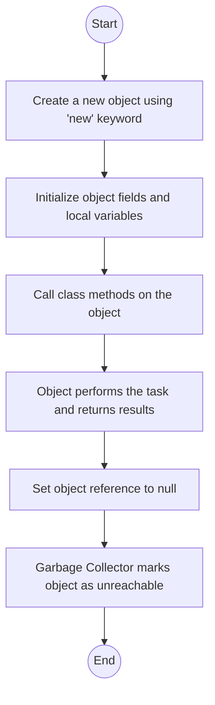
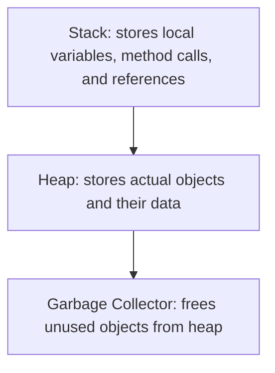

# Lab: Memory Management

## 1. Flowchart
$${\color{lightblue}Main \space Program \space Flow}$$

$${\color{red}Stack \space and \space Heap \space Overview}$$


## 2. Challenges:

**Design Phase:**

Choosing an example that clearly shows the difference between stack and heap memory.

Making sure the program demonstrates how the garbage collector works.
<br>
</br>

**Implementation Phase:**

Understanding when an object becomes unreachable and eligible for garbage collection.

Keeping track of where variables are stored on the stack and where objects live in the heap.

Testing how setting a reference to `null` affects the memory structure.

## 3. Video:

In this lab, I created a simple Java program to understand how memory management works in Java using stack and heap memory. The program defines a class called `Person` with fields and a method, and the main program creates objects of this class. When we create an object using the new keyword, the reference to that object is stored on the stack, while the actual object and its data are stored in the heap. For example, when we write `Person p1 = new Person("Alice", 25)`, the variable `p1` is on the stack, but the object itself is in the heap.

I also demonstrated garbage collection by setting an object reference to `null`. Once an object has no active references, it becomes unreachable, and Java’s garbage collector can free the memory used by that object automatically.

This lab helped me understand how Java manages memory, the difference between the stack and heap, and how unused objects are removed without manually deleting them. It showed how local variables, method calls, and references work together to manage memory efficiently.

## 4. Code:
`MemoryDemo.java`
``` java
// A simple Java program demonstrating memory management, stack, heap, and garbage collection.
class Person {
    String name;  // Stored on the heap
    int age;      // Stored on the heap

    // Constructor
    Person(String name, int age) {
        this.name = name;
        this.age = age;
    }

    // Method to print info about the person
    void introduce() {
        System.out.println("Hi, my name is " + name + " and I am " + age + " years old.");
    }
}

public class MemoryDemo {
    public static void main(String[] args) {
        // Step 1: Object creation -> Reference stored on stack, object stored on heap
        Person p1 = new Person("Alice", 25);
        Person p2 = new Person("Bob", 30);

        // Step 2: Method calls → Uses stack for local variables, heap for object fields
        p1.introduce();
        p2.introduce();

        // Step 3: Set one reference to null -> Alice's object becomes unreachable
        p1 = null;

        // Step 4: Suggest garbage collection (not guaranteed to run immediately)
        System.gc();

        System.out.println("Memory management demo completed!");
    }
}
```
## 5. Stack and Heap Mapping

| **Action**                             | **Stack (References)**    | **Heap (Objects)**                               |
| -------------------------------------- | ------------------------- | ------------------------------------------------ |
| Person p1 = new Person("Alice", 25)    | p1 → address X            | Person object: name="Alice", age=25              |
| Person p2 = new Person("Bob", 30)      | p2 → address Y            | Person object: name="Bob", age=30                |
| p1 = null;                             | p1 = null                 | Alice’s object becomes **unreachable**           |
| System.gc();                           | —                         | Garbage collector **may reclaim Alice’s memory** |
