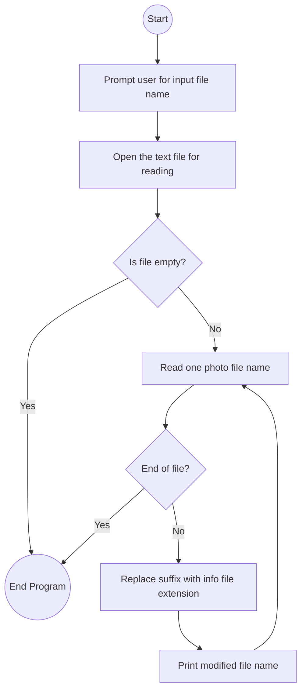

# Lab: Input and output

## 1. Flowchart


## 2. Challenges:

**Design Phase:**

Choosing how to handle string replacement cleanly.

Making sure the program stops if the file is empty.
<br>
</br>

**Implementation Phase:**

Handling file input line by line without skipping blank lines.

Ensuring the replacement only affects the suffix `"_photo.jpg"` and not other parts of the string.

Testing with multiple file names to confirm consistent results.

## 3. Video:
In this lab, I wrote a Java program that edits file names inside a text file. The program first asks the user to enter the name of the input file. It then opens that file and reads one photo file name per line. For each file name, it replaces the ending `"_photo.jpg"` with `"_info.txt"` and prints the result. This way, instead of listing photo files, we get the names of the matching information files.

For example, if the file contains `Acadia2003_photo.jpg,` the program outputs `Acadia2003_info.txt.` I used Java’s string replacement function so the code is simple and reliable. If the input file is empty, the program produces no output, just as the instructions require.

This lab helped me practice working with file input and output, reading a file line by line, and using string manipulation to change file names in a consistent way.

## 4. Code:
`PhotoFileEditor.java`
``` java
import java.io.File;
import java.io.FileNotFoundException;
import java.util.Scanner;

public class PhotoFileEditor {
    public static void main(String[] args) {
        Scanner scnr = new Scanner(System.in);
        System.out.print("Enter input file name: ");
        String fileName = scnr.nextLine();

        try {
            File inputFile = new File(fileName);
            Scanner fileScanner = new Scanner(inputFile);

            while (fileScanner.hasNextLine()) {
                String photoFile = fileScanner.nextLine().trim();
                if (!photoFile.isEmpty()) {
                    // Replace "_photo.jpg" with "_info.txt"
                    String infoFile = photoFile.replace("_photo.jpg", "_info.txt");
                    System.out.println(infoFile);
                }
            }

            fileScanner.close();
        } catch (FileNotFoundException e) {
            System.out.println("Error: File not found.");
        }

        scnr.close();
    }
}
```

## 5. Testing:
**Input file: `ParkPhotos.txt`**

```
Acadia2003_photo.jpg
AmericanSamoa1989_photo.jpg
BlackCanyonoftheGunnison1983_photo.jpg
CarlsbadCaverns2010_photo.jpg
CraterLake1996_photo.jpg
GrandCanyon1996_photo.jpg
IndianaDunes1987_photo.jpg
LakeClark2009_photo.jpg
Redwood1980_photo.jpg
VirginIslands2007_photo.jpg
Voyageurs2006_photo.jpg
WrangellStElias1987_photo.jpg
```

**Program output:**
```
Acadia2003_info.txt
AmericanSamoa1989_info.txt
BlackCanyonoftheGunnison1983_info.txt
CarlsbadCaverns2010_info.txt
CraterLake1996_info.txt
GrandCanyon1996_info.txt
IndianaDunes1987_info.txt
LakeClark2009_info.txt
Redwood1980_info.txt
VirginIslands2007_info.txt
Voyageurs2006_info.txt
WrangellStElias1987_info.txt
```
