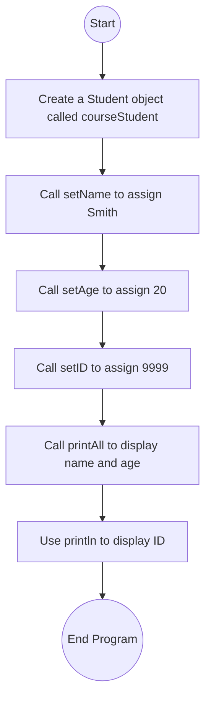

# Lab: Input and output

## 1. Flowchart


## 2. Challenges:

**Design Phase:**

Understanding how to connect a subclass (Student) with its superclass (Person).

Deciding which data belongs in the superclass (name, age) vs. the subclass (student ID).
<br>
</br>

**Implementation Phase:**

Remembering to call `setName`, `setAge`, and `setID` before printing.

Ensuring that `printAll()` only prints name and age, while a separate `println()` prints the ID.

Making sure the output matches the exact required format.

## 3. Video:
In this lab, I practiced how inheritance works in Java by creating a `Person` superclass and a `Student` subclass. The `Person` class stores general information such as name and age, while the `Student` class extends it by adding a student ID.

In the `main` program, I created a `Student` object called `courseStudent`. I used the inherited methods from `Person` to set the student’s name to Smith and age to 20, and I used the subclass method `setID` to set the student’s ID to 9999. After that, I called the `printAll()` method, which comes from the `Person` class, to print the name and age, and then added a separate `println()` to show the ID.

The final program output was:

`Name: Smith, Age: 20, ID: 9999`

This lab helped me understand how a subclass can reuse code from a superclass, and how new fields and methods can be added to extend functionality without rewriting everything from scratch.

## 4. Code:
<details> <summary> Click to get the Person.java </summary>
<p>
  
``` java
public class Person {
   private int ageYears;
   private String lastName;

   public void setName(String userName) {
      lastName = userName;
   }

   public void setAge(int numYears) {
      ageYears = numYears;
   }

   public void printAll() {
      System.out.print("Name: " + lastName);
      System.out.print(", Age: " + ageYears);
   }
}
```
</p>
</details>

<details> <summary> Click to get the Student.java </summary>
<p>
  
``` java
public class Student extends Person {
   private int idNum;

   public void setID(int studentId) {
      idNum = studentId;
   }

   public int getID() {
      return idNum;
   }
}
```
</p>
</details>

<details> <summary> Click to get the StudentDerivationFromPerson.java </summary>
<p>

``` java
public class StudentDerivationFromPerson {
   public static void main(String[] args) {
      Student courseStudent = new Student();

      // Assign values
      courseStudent.setName("Smith");
      courseStudent.setAge(20);
      courseStudent.setID(9999);

      // Print results
      courseStudent.printAll();
      System.out.println(", ID: " + courseStudent.getID());
   }
}
```
</p>
</details>
