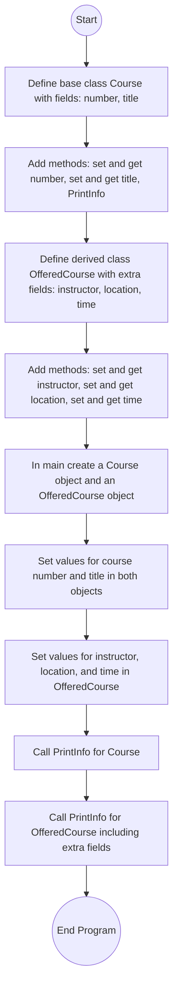

# Lab: Derived classes

## 1. Flowchart


## 2. Challenges:

**Design Phase:**

Deciding which fields belong in the base class (Course) and which belong in the derived class (OfferedCourse).

Making sure the base class handles general course information while the derived class adds extended details.
<br>
</br>

**Implementation Phase:**

Properly reusing `PrintInfo()` so the derived class can show both base fields and its own fields.

Ensuring the output formatting matches exactly as shown in the expected result.

Handling input values in the correct order to test both classes.

## 3. Video:
In this lab, I worked with inheritance to create a base class and a derived class for storing course information. The base class, `Course`, has private fields for the course number and title, along with setter and getter methods and a `PrintInfo()` method that displays these details.

The derived class, `OfferedCourse`, extends `Course` and adds private fields for the instructor’s name, location, and class time, with corresponding setters and getters. Its `PrintInfo()` method first calls the base class `PrintInfo()` to display the course number and title, and then adds the instructor, location, and time.

In the `main` method, I first created a `Course` object and set its number and title. Then, I created an `OfferedCourse` object and set its number, title, instructor, location, and time. Calling `PrintInfo()` on each object produced the expected results.

This lab helped me understand how a derived class builds on a base class, how to organize shared versus specialized data, and how to reuse code effectively with inheritance.

## 4. Code:
<details> <summary> Click to get the Course.java </summary>
<p>

``` java
public class Course {
    private String courseNumber;
    private String courseTitle;

    public void setCourseNumber(String number) {
        courseNumber = number;
    }

    public void setCourseTitle(String title) {
        courseTitle = title;
    }

    public String getCourseNumber() {
        return courseNumber;
    }

    public String getCourseTitle() {
        return courseTitle;
    }

    public void PrintInfo() {
        System.out.println("Course Information:");
        System.out.println("   Course Number: " + courseNumber);
        System.out.println("   Course Title: " + courseTitle);
    }
}
```
</p>
</details>

<details> <summary> Click to get the OfferedCourse.java </summary>
<p>

``` java
public class OfferedCourse extends Course {
    private String instructorName;
    private String location;
    private String classTime;

    public void setInstructorName(String instructor) {
        instructorName = instructor;
    }

    public void setLocation(String loc) {
        location = loc;
    }

    public void setClassTime(String time) {
        classTime = time;
    }

    public String getInstructorName() {
        return instructorName;
    }

    public String getLocation() {
        return location;
    }

    public String getClassTime() {
        return classTime;
    }

    @Override
    public void PrintInfo() {
        super.PrintInfo(); // Call base class method
        System.out.println("   Instructor Name: " + instructorName);
        System.out.println("   Location: " + location);
        System.out.println("   Class Time: " + classTime);
    }
}
```
</p>
</details>

<details> <summary> Click to get the DerivedClassesMain.java </summary>
<p>

``` java
import java.util.Scanner;

public class DerivedClassesMain {
    public static void main(String[] args) {
        Scanner scnr = new Scanner(System.in);

        // Read input
        String course1Number = scnr.nextLine();
        String course1Title = scnr.nextLine();
        String course2Number = scnr.nextLine();
        String course2Title = scnr.nextLine();
        String instructor = scnr.nextLine();
        String location = scnr.nextLine();
        String time = scnr.nextLine();

        // Create base class object
        Course course1 = new Course();
        course1.setCourseNumber(course1Number);
        course1.setCourseTitle(course1Title);

        // Create derived class object
        OfferedCourse course2 = new OfferedCourse();
        course2.setCourseNumber(course2Number);
        course2.setCourseTitle(course2Title);
        course2.setInstructorName(instructor);
        course2.setLocation(location);
        course2.setClassTime(time);

        // Print course info
        course1.PrintInfo();
        course2.PrintInfo();

        scnr.close();
    }
}
```
</p>
</details>

## 5. Testing:
**Program expected output:**
```
Course Information:
   Course Number: ECE287
   Course Title: Digital Systems Design
Course Information:
   Course Number: ECE387
   Course Title: Embedded Systems Design
   Instructor Name: Mark Patterson
   Location: Wilson Hall 231
   Class Time: WF: 2-3:30 pm
```
