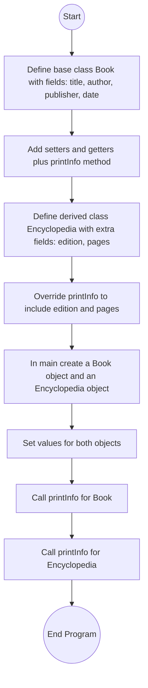

# Lab: Overriding Methods

## 1. Flowchart


## 2. Challenges:

**Design Phase:**

Understanding how method overriding works and when to use it instead of creating new methods.

Deciding what information belongs in the `Book` base class and what belongs in the `Encyclopedia` subclass.
<br>
</br>

**Implementation Phase:**

Ensuring `printInfo()` in `Encyclopedia` properly overrides the one from `Book`.

Using `super.printInfo()` to avoid repeating code for the shared details.

Making sure the output format matches the required indentation and labels exactly.

## 3. Video:
In this lab, I worked with method overriding in Java. The base class `Book` contains fields for the title, author, publisher, and publication date, as well as a `printInfo()` method that prints these details.

The derived class `Encyclopedia` extends `Book` and adds two new fields: edition and number of pages. It overrides the `printInfo()` method to include both the base class details and the new fields. To avoid repeating code, the method first calls `super.printInfo()` from the base class, and then prints edition and pages.

In the `main` program, I created both a `Book` object and an `Encyclopedia` object. The book stored information about The Hobbit, and the encyclopedia stored information about The Illustrated Encyclopedia of the Universe. When calling `printInfo()`, the book displayed only the basic details, while the encyclopedia displayed the base details plus edition and number of pages.

This lab helped me clearly understand how overriding works: the subclass can replace or extend a method from the superclass, and we can still reuse code with `super`.

## 4. Code:
<details> <summary> Click to get the Book.java </summary>
<p>

``` java
public class Book {
    private String title;
    private String author;
    private String publisher;
    private String publicationDate;

    public void setTitle(String t) {
        title = t;
    }

    public void setAuthor(String a) {
        author = a;
    }

    public void setPublisher(String p) {
        publisher = p;
    }

    public void setPublicationDate(String d) {
        publicationDate = d;
    }

    public String getTitle() {
        return title;
    }

    public String getAuthor() {
        return author;
    }

    public String getPublisher() {
        return publisher;
    }

    public String getPublicationDate() {
        return publicationDate;
    }

    public void printInfo() {
        System.out.println("Book Information: ");
        System.out.println("   Book Title: " + title);
        System.out.println("   Author: " + author);
        System.out.println("   Publisher: " + publisher);
        System.out.println("   Publication Date: " + publicationDate);
    }
}
```
</p>
</details>

<details> <summary> Click to get the Encyclopedia.java </summary>
<p>

``` java
public class Encyclopedia extends Book {
    private String edition;
    private int numPages;

    public void setEdition(String e) {
        edition = e;
    }

    public void setNumPages(int n) {
        numPages = n;
    }

    public String getEdition() {
        return edition;
    }

    public int getNumPages() {
        return numPages;
    }

    @Override
    public void printInfo() {
        super.printInfo(); // Print Book details
        System.out.println("   Edition: " + edition);
        System.out.println("   Number of Pages: " + numPages);
    }
}
```
</p>
</details>

<details> <summary> Click to get the OverridingMain.java </summary>
<p>

``` java
import java.util.Scanner;

public class OverridingMain {
    public static void main(String[] args) {
        Scanner scnr = new Scanner(System.in);

        // Read input
        String title1 = scnr.nextLine();
        String author1 = scnr.nextLine();
        String publisher1 = scnr.nextLine();
        String date1 = scnr.nextLine();

        String title2 = scnr.nextLine();
        String author2 = scnr.nextLine();
        String publisher2 = scnr.nextLine();
        String date2 = scnr.nextLine();
        String edition = scnr.nextLine();
        int pages = scnr.nextInt();

        // Create Book object
        Book book1 = new Book();
        book1.setTitle(title1);
        book1.setAuthor(author1);
        book1.setPublisher(publisher1);
        book1.setPublicationDate(date1);

        // Create Encyclopedia object
        Encyclopedia book2 = new Encyclopedia();
        book2.setTitle(title2);
        book2.setAuthor(author2);
        book2.setPublisher(publisher2);
        book2.setPublicationDate(date2);
        book2.setEdition(edition);
        book2.setNumPages(pages);

        // Print information
        book1.printInfo();
        book2.printInfo();

        scnr.close();
    }
}
```
</p>
</details>

## 5. Testing:
**Program expected output:**
```
Book Information: 
   Book Title: The Hobbit
   Author: J. R. R. Tolkien
   Publisher: George Allen & Unwin
   Publication Date: 21 September 1937
Book Information: 
   Book Title: The Illustrated Encyclopedia of the Universe
   Author: Ian Ridpath
   Publisher: Watson-Guptill
   Publication Date: 2001
   Edition: 2nd
   Number of Pages: 384
```
