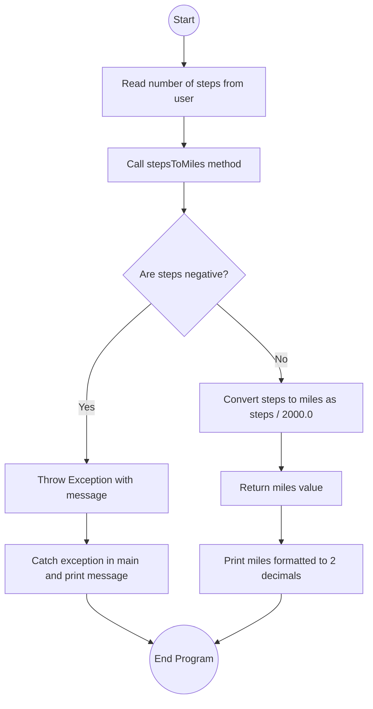

# Lab: Exceptions

## 1. Flowchart


## 2. Challenges:

**Design Phase:**

Understanding how to properly use `throw` and `catch` for exceptions.

Deciding where to validate the input (inside `stepsToMiles()` rather than in `main()`).
<br>
</br>

**Implementation Phase:**

Ensuring the program prints the exact exception message when a negative value is entered.

Formatting the miles to two decimal places with `System.out.printf()`.

Testing both valid and invalid inputs to confirm correct behavior.

## 3. Video:
In this lab, I learned how to use exceptions in Java. I created a method `stepsToMiles()` that converts steps into miles, knowing that 2,000 steps equals 1 mile. The method checks if the number of steps is negative, and if so, it throws an exception with the message: "Exception: Negative step count entered."

In the `main` method, I used a try-catch block to handle this exception. If the steps are valid, the miles are calculated and displayed with two decimal places. If the steps are negative, the program catches the exception and prints the message.

This lab helped me understand how exceptions are useful for handling errors in programs, keeping the code clean and preventing crashes when invalid input is given.

## 4. Code:
`StepCounter.java`

``` java
import java.util.Scanner;

public class StepCounter {

    // Method to convert steps to miles
    public static double stepsToMiles(int steps) throws Exception {
        if (steps < 0) {
            throw new Exception("Exception: Negative step count entered.");
        }
        return steps / 2000.0;
    }

    public static void main(String[] args) {
        Scanner scnr = new Scanner(System.in);
        int steps = scnr.nextInt();

        try {
            double miles = stepsToMiles(steps);
            System.out.printf("%.2f\n", miles);
        } catch (Exception e) {
            System.out.println(e.getMessage());
        }

        scnr.close();
    }
}
```
