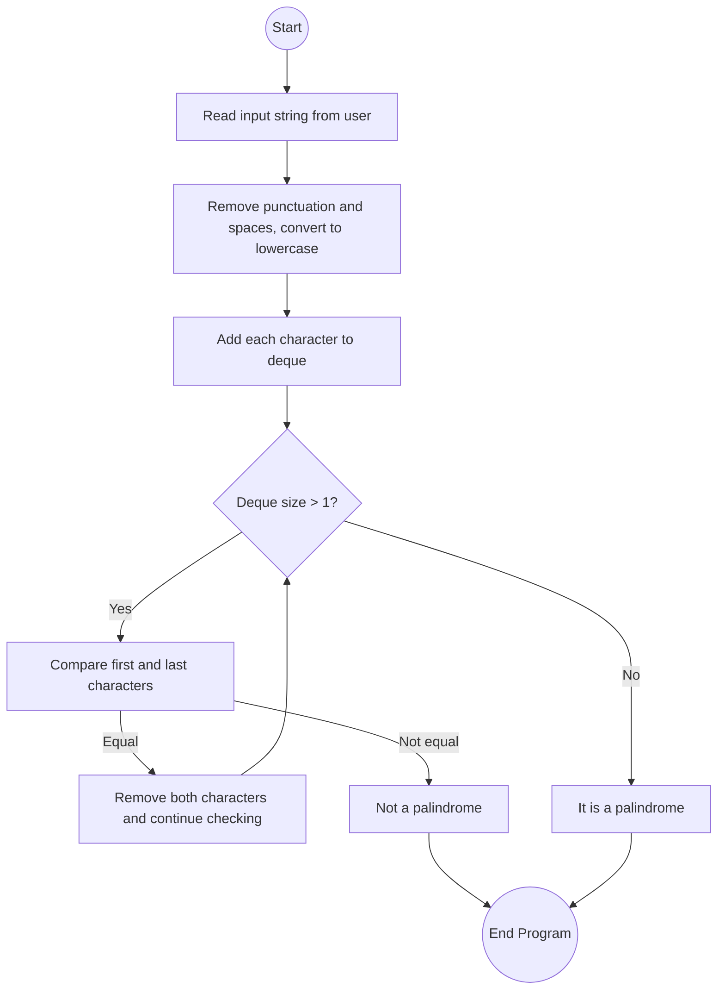

# Lab: Collections
## 1. Flowchart


## 2. Challenges:

**Design Phase:**

Choosing the right data structure for comparing characters from both ends efficiently.

Understanding how to use Deque methods like `addLast()`, `removeFirst()`, and `removeLast()`.
<br>
</br>

**Implementation Phase:**

Ensuring the program ignores punctuation, spaces, and capitalization.

Handling one-character strings as a valid palindrome case.

Making sure the output matches the exact required format.

## 3. Video:
In this lab, I learned how to use Java collections, specifically a Deque, to check if a word or phrase is a palindrome. A palindrome is a string that reads the same forward and backward, such as “civic”.

The program reads a line of text from the user, converts it to lowercase, and removes spaces and punctuation. Each character is added to a deque, allowing comparisons from both ends. I used a while loop to remove and compare the first and last characters until the deque had one or zero characters left.

If all pairs match, the program prints that the input is a palindrome; otherwise, it prints that it’s not. I also included a special case for one-character strings since they are automatically palindromes.

This activity helped me understand how deques can simplify tasks that require checking data from both ends efficiently.

## 4. Code:
`PalindromeChecker.java`

``` java
import java.util.Deque;
import java.util.LinkedList;
import java.util.Scanner;

public class PalindromeChecker {
    public static void main(String[] args) {
        Scanner scnr = new Scanner(System.in);
        String input = scnr.nextLine();
        scnr.close();

        // Clean input: remove non-letters and lowercase everything
        String cleaned = input.replaceAll("[^a-zA-Z]", "").toLowerCase();

        // Deque to hold characters
        Deque<Character> deque = new LinkedList<>();

        for (char ch : cleaned.toCharArray()) {
            deque.addLast(ch);
        }

        boolean isPalindrome = true;

        // Check characters from both ends
        while (deque.size() > 1) {
            if (!deque.removeFirst().equals(deque.removeLast())) {
                isPalindrome = false;
                break;
            }
        }

        if (isPalindrome) {
            System.out.println("Yes, " + input + " is a palindrome.");
        } else {
            System.out.println("No, \"" + input + "\" is not a palindrome.");
        }
    }
}
```

## 5. Testing:

**Program expected input/output:**

Input 1:
```nginx
civic
```
Output 1:
```csharp
Yes, civic is a palindrome.
```
<br>
</br>

Input 2:
```nginx
rotostor
```
Output 2:
```pgsql
No, "rotostor" is not a palindrome.
```
